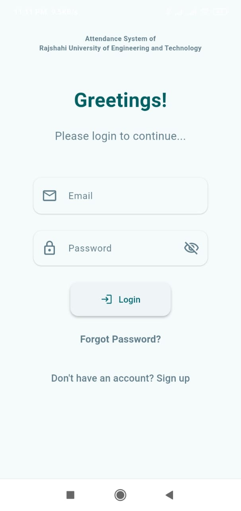
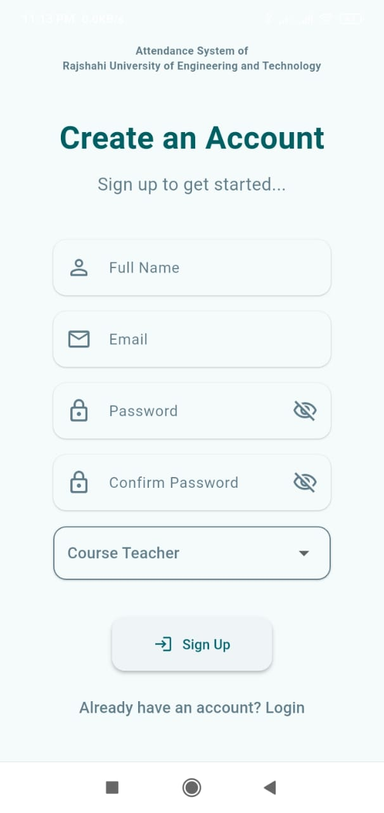
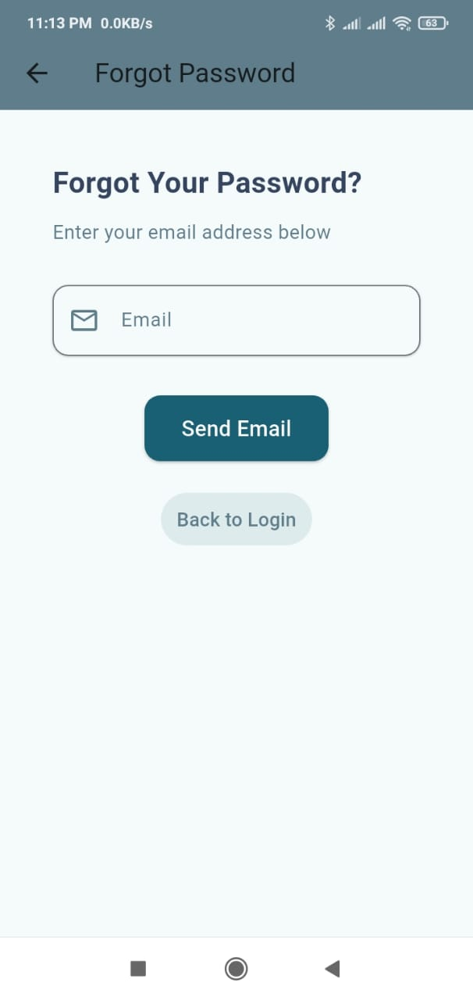
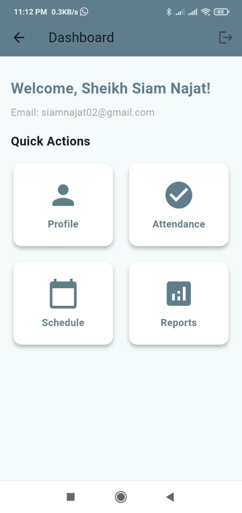
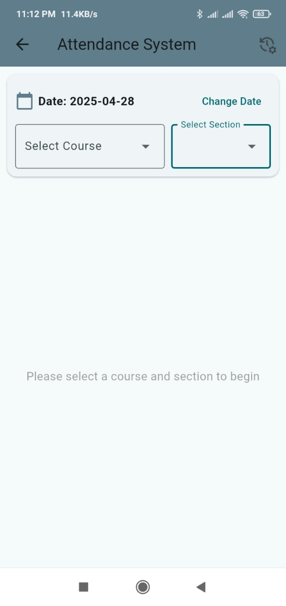

# SAMS - Student Attendance Management System


SAMS is a cross-platform mobile application built using **Flutter** and **Firebase**, designed to help teachers manage student attendance efficiently. Initially developed for the **CSE-22 Series** at **Rajshahi University of Engineering and Technology (RUET)**, this app aims to streamline academic attendance management through a simple and scalable system.

---

**SAMS** is a mobile application designed for managing student attendance in educational institutions. It supports teachers' login and offers features for attendance tracking. Built with Flutter and Firebase, this system helps streamline attendance management. Initially built for Rajshahi University of Engineering and Technology (RUET), specifically for the CSE-22 series department.

## Features

- **Teacher Role**: 
  - Mark attendance for students
  - Track attendance statistics for courses
- **Attendance summary charts**
- **CSV/PDF export of attendance data**
  
### Future Features
- Department Head Role
- Course Advisor Role
- Student Role
- Open for all Departments

## Screenshots

| Login Page | Signup Page |
|:----------:|:-----------:|
|  |  |

| Forgot Password | Dashboard |
|:---------------:|:---------:|
|  |  |

| Attendance Page | Reports Page |
|:---------------:|:------------:|
|  |  |

## Tech Stack

- **Flutter** — Cross-platform mobile development
- **Dart** — Programming language
- **Firebase Authentication** — User sign-up and login management
- **Firebase Firestore** — NoSQL cloud database for storing attendance data
- **shared_preferences** — Local key-value storage
- **image_picker** — Select images from gallery or camera
- **pdf** — Generate and export attendance reports as PDFs
- **excel** — Export attendance data in Excel format
- **open_file** — Open exported files from the app
- **path_provider** — Access device file system paths
- **flutter_launcher_icons** — Generate app icons for Android and iOS
- **flutter_test** — Testing framework
- **flutter_lints** — Enforce code quality standards

## Getting Started

### Prerequisites
- [Flutter](https://flutter.dev/docs/get-started/install)
- Firebase account and project setup
- Android Studio or Xcode for emulator/device testing

### Installation

```bash
# Clone the repository
git clone https://github.com/najat-ttt/SAMS_Basic.git
cd SAMS_Basic

# Install dependencies
flutter pub get
```

### Configure Firebase

To connect the app to your Firebase project:

1. Go to the [Firebase Console](https://console.firebase.google.com/) and create a new project
2. Add an **Android** app and/or an **iOS** app in your project settings
3. Download the `google-services.json` file and place it inside the `android/app/` directory
4. Download the `GoogleService-Info.plist` file and place it inside the `ios/Runner/` directory
5. Make sure to enable required Firebase services like **Authentication** and **Firestore Database**

> For detailed setup instructions, refer to the official [FlutterFire documentation](https://firebase.flutter.dev/docs/overview)

### Run the App

Once everything is set up, start the app on your connected device or emulator:

```bash
flutter run
```

### Troubleshooting

- Ensure your Flutter SDK version matches the project requirement (**`sdk: ^3.7.0`**)
- If you encounter Firebase-related build errors:
  - Verify that `google-services.json` is correctly placed inside `android/app/`
  - Verify that `GoogleService-Info.plist` is correctly placed inside `ios/Runner/`
- Run the following command to check if your development environment is properly set up:

```bash
flutter doctor
```

## Contributing

If you'd like to contribute:

1. **Fork** the repository
2. **Create a new branch**:
   ```bash
   git checkout -b feature-branch
   ```
3. **Commit** your changes:
   ```bash
   git commit -m "Add: new feature"
   ```
4. **Push** to your branch:
   ```bash
   git push origin feature-branch
   ```
5. Create a **Pull Request**

## License

This project is licensed under the **MIT License**.  
See the [LICENSE](LICENSE) file for more details.

## Acknowledgments

- Thanks to **Flutter** for the awesome UI framework
- Thanks to **Firebase** for providing scalable backend services

## Contact

**Author**: [Sheikh Siam Najat](https://www.linkedin.com/in/sheikhsiamnajat/)  
**Email**: [siamnajat02@gmail.com](mailto:siamnajat02@gmail.com)
